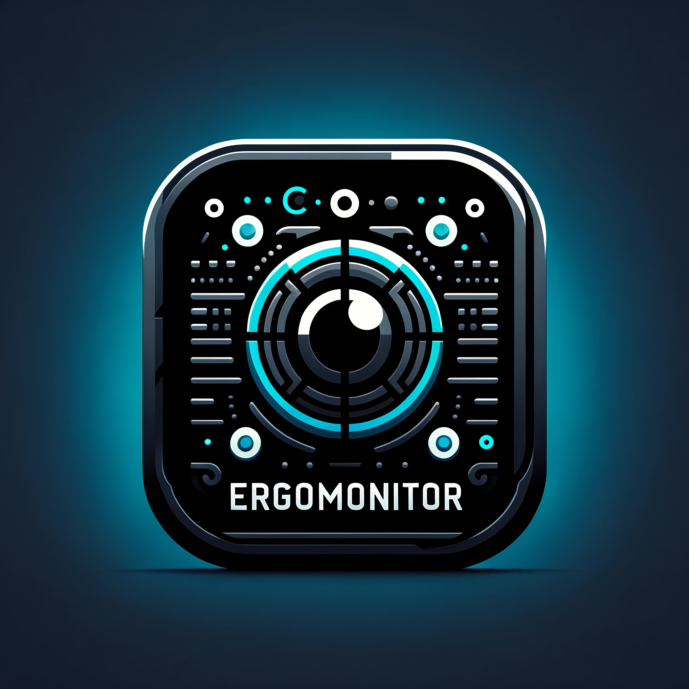

# ErgoMonitor

## Overview
ErgoMonitor is a state-of-the-art system monitoring application, meticulously developed by [Protoncracker](https://github.com/protoncracker) and [SamuelSchutz13](https://github.com/SamuelSchutz13). Leveraging Python's powerful capabilities, it provides unparalleled insights into your computer's operations. ErgoMonitor is designed not just to monitor but to analyze - offering detailed reports on system health, performance metrics, and security status. Its proactive approach in identifying anomalies and potential threats makes it an indispensable tool for maintaining system integrity and efficiency.

## Key Features
- **Comprehensive System Monitoring**: Extensively tracks and reports on CPU, memory, storage, and network usage, giving a full picture of system health.
- **Advanced Threat Detection**: Employs sophisticated algorithms to detect and alert on suspicious activities, safeguarding against vulnerabilities and intrusions.
- **Rich API Integration**: Interfaces with a wide range of APIs for enhanced data gathering and analysis, providing a granular view of system performance.
- **Elegant User Interface**: Combines functionality with aesthetics, offering a user-friendly experience that simplifies complex data interpretation.
- **Customizable Alerts and Notifications**: Tailor notifications to meet specific needs, ensuring that critical issues are never missed.
- **Extensible Architecture**: Designed for easy expansion and customization, allowing for integration with additional tools and services.

## Installation
Get started with ErgoMonitor using these simple steps:
1. Clone the repository: `git clone https://github.com/Protoncracker/ErgoMonitor`
2. Navigate to the ErgoMonitor directory: `cd ErgoMonitor`
3. Install dependencies: `pip install -r requirements.txt`
4. Run ErgoMonitor: `python ErgoMonitor.py`

## Usage
For a quick start, refer to [USAGE.md](docs/USAGE.md). Key usage steps include:
- Configuring system monitoring parameters.
- Setting up alert thresholds and notification preferences.
- Interpreting the dashboard and reports for system analysis.

## Documentation
ErgoMonitor offers a wide range of documentation to support users and developers:
- [API_DOCUMENTATION.md](docs/API_DOCUMENTATION.md) - Details on how to integrate and utilize the APIs within ErgoMonitor.
- [CHANGELOG.md](docs/CHANGELOG.md) - Records all significant changes, enhancements, and bug fixes applied to ErgoMonitor.
- [CODE_OF_CONDUCT.md](docs/CODE_OF_CONDUCT.md) - Outlines expectations for participation in our community, as well as the steps for reporting unacceptable behavior.
- [CONTRIBUTING.md](docs/CONTRIBUTING.md) - Guidelines for those who wish to contribute to ErgoMonitor, including how to submit bugs, feature requests, and code contributions.
- [DEVELOPER_GUIDE.md](docs/DEVELOPER_GUIDE.md) - Provides developers with the necessary information to understand ErgoMonitor's architecture to use and contribute effectively.
- [ErgoMonitor_structure.txt](docs/ErgoMonitor_structure.txt) - Offers a detailed representation of ErgoMonitor's project structure, helping developers navigate the codebase.
- [FAQ.md](docs/FAQ.md) - Answers to Frequently Asked Questions, aiding users in troubleshooting common issues and understanding ErgoMonitor's features.
- [INSTALLATION.md](docs/INSTALLATION.md) - Step-by-step guide to installing ErgoMonitor, ensuring users can get the application up and running smoothly.
- [LICENSE.md](docs/LICENSE.md) - The full license text under which ErgoMonitor is distributed, clarifying the terms under which the software can be used, modified, and distributed.
- [README.md](docs/README.md) - Provides a full exhibit of ErgoMonitor, including its purpose, key features, and how to get started with the application in detail.
- [SECURITY.md](docs/SECURITY.md) - Information on the security measures in ErgoMonitor, including how to report security vulnerabilities.
- [USAGE.md](docs/USAGE.md) - Detailed instructions on how to use ErgoMonitor, helping users make the most of its features.

We encourage users and contributors to explore these documents to fully understand and effectively utilize ErgoMonitor.

## Contributions
We warmly welcome contributions to ErgoMonitor! If you're interested in contributing, please consult our [CONTRIBUTING](docs/CONTRIBUTING.md) document for contribution guidelines. Every idea, big or small, helps in making ErgoMonitor better for everyone.

## License
ErgoMonitor is distributed under the [xyz] license. This license allows for free use and noncomercial distribution, with proper attribution to the original creators.

## Credits
- [Protoncracker](https://github.com/protoncracker) - [email/contact information]
- [SamuelSchutz13](https://github.com/SamuelSchutz13) - [email/contact information]

Special thanks to all contributors who have helped enhance and expand ErgoMonitor.
